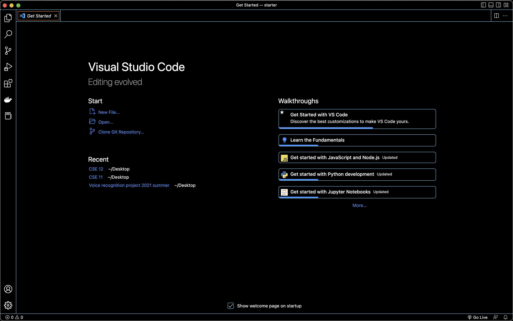
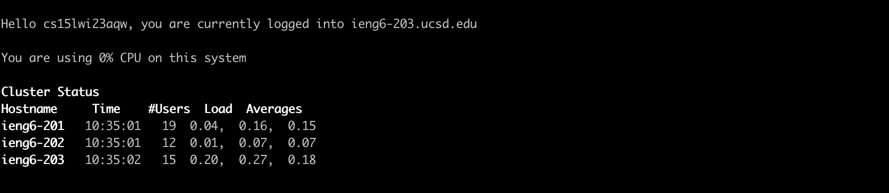
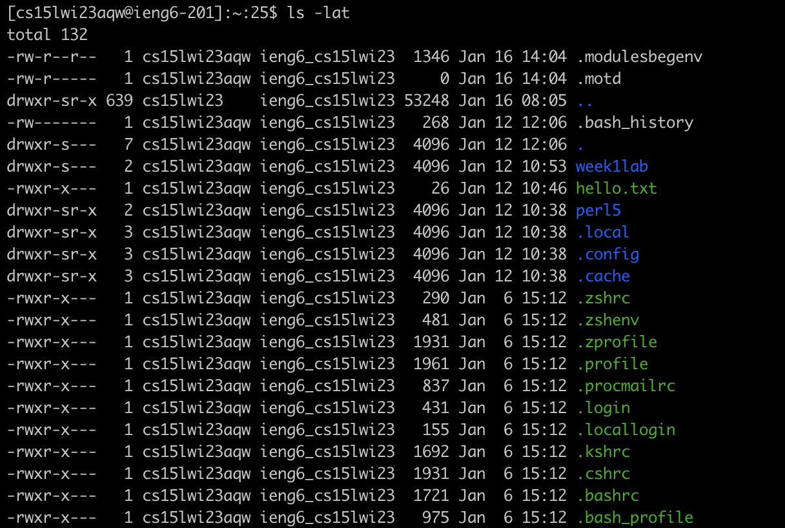
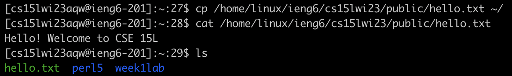

# Lab 1 Report
This report will be on how to remote access, from installing VSCode to running some commands in the Terminal window

---
## Step 1: Installing VSCode

After downloading VSCode from the [link](https://code.visualstudio.com/), you should get a home page that looks similar to this:

However, if you have downloaded VSCode before and already have open projects, then the last project you were working on will open. 

---
## Step 2: Remote Connecting
Since my Macbook already has git installed in Terminal, I don't need to install git again. 

Since I have a Macbook, I can open up the Terminal application. However, if others have a Windows computer, they could use Terminal in their VSCode that they downloaded in step one by clicking on new terminal. To find my CSE15l account, I first went to this [site](https://sdacs.ucsd.edu/~icc/index.php). Then, I opened up the [google doc](https://docs.google.com/document/d/1hs7CyQeh-MdUfM9uv99i8tqfneos6Y8bDU0uhn1wqho/edit?usp=sharing) to figure out how to reset my password on my CSE15l account. In Terminal, I ran 
```
ssh cs15lwi23aqw@ieng6.ucsd.edu
```
then typed in the password I set up for this account. Other students won't have the letters "aqw", but will have a different three letter combination. They will find their own specific three letter combination from the [link](https://sdacs.ucsd.edu/~icc/index.php) above which leads students to their CSE15l account.  

After a few seconds, the Terminal should look something like this:


---
## Step 3: Trying Some Commands
1. ls -lat will show hidden files in the long versionthat I usually can't see, as well as the last time I edited those files.
2. ls -a will show the hidden files, but only the names. 
3. cp will copy the file. cat will concatonate a file.  Notice in the last couple of lines when I listed out all the files, hello.txt was one of the files listed.
```
ls
hello.txt perl5 week1lab 
```
That's because I copied the file with the command 
```
cp /home/linux/ieng6/cs15lwi23/public/hello.txt
```
