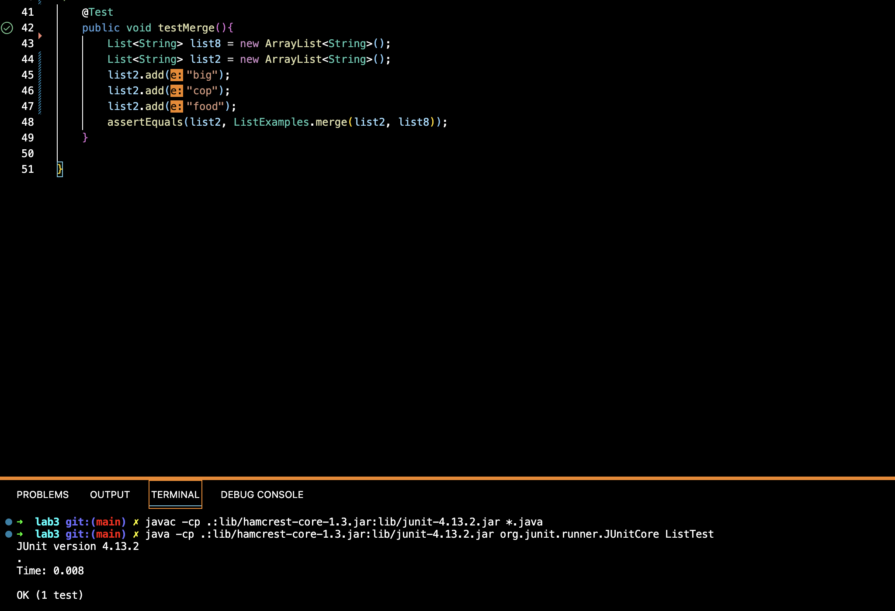

# Lab 2 Report
## Part 1
For my StringServer class, I also implemented methods in the Server class provided to us in the week 2 lab. The first screenshot is the StringServer class. 

The screenshot below is the Server class provided to us. 

The next two screenshots are when I ran a web server with the specific paths and queries given to us in the lab report. 


## Part 2
For the listExamples class, there was a bug in the merge method. One failure-inducing input is written below as a test.
```
    @Test
    public void testMerge(){
        List<String> list5 = new ArrayList<String>();
        list5.add("big");
        List<String> list6 = new ArrayList<String>();
        list6.add("freak");
        List<String> list7 = new ArrayList<String>();
        list7.add("big");
        list7.add("freak");
        assertEquals(list7, ListExamples.merge(list5, list6));
    }
```
There's also inputs that don't induce a failure, such as the test written below.
```
    @Test
    public void testMerge(){
        List<String> list8 = new ArrayList<String>();
        List<String> list2 = new ArrayList<String>();
        list2.add("big");
        list2.add("cop");
        list2.add("food");
        assertEquals(list2, ListExamples.merge(list2, list8));
    }
```
From the screenshot below, if we run the test for the failure-inducing input that I wrote above, there is an memory error. However, the merge method should return the two lists together in one array in sorted order. 

From the screenshot below, if we run the test for the input that doesn't induce a failure, we see that it passes the test. 

In the code block below is the merge method with the bug.
```
  // Takes two sorted list of strings (so "a" appears before "b" and so on),
  // and return a new list that has all the strings in both list in sorted order.
  static List<String> merge(List<String> list1, List<String> list2) {
    List<String> result = new ArrayList<>();
    int index1 = 0, index2 = 0;
    while(index1 < list1.size() && index2 < list2.size()) { 
      if(list1.get(index1).compareTo(list2.get(index2)) < 0) {
        result.add(list1.get(index1));
        index1 += 1;
      }
      else {
        result.add(list2.get(index2));
        index2 += 1;
      }
    }
    while(index1 < list1.size()) {
      result.add(list1.get(index1));
      index1 += 1;
    }
    while(index2 < list2.size()) {
      result.add(list2.get(index2));
      index1 += 1;
    }
    return result;
  }
```
And below is the merge method with the bug fixed. 
```
  // Takes two sorted list of strings (so "a" appears before "b" and so on),
  // and return a new list that has all the strings in both list in sorted order.
  static List<String> merge(List<String> list1, List<String> list2) {
    List<String> result = new ArrayList<>();
    int index1 = 0, index2 = 0;
    while(index1 < list1.size() && index2 < list2.size()) { 
      if(list1.get(index1).compareTo(list2.get(index2)) < 0) {
        result.add(list1.get(index1));
        index1 += 1;
      }
      else {
        result.add(list2.get(index2));
        index2 += 1;
      }
    }
    while(index1 < list1.size()) {
      result.add(list1.get(index1));
      index1 += 1;
    }
    while(index2 < list2.size()) {
      result.add(list2.get(index2));
      index2 += 1;
    }
    return result;
  }
```
There was only one line that needed fixing, which is in the last while statement. The bugged code was written as 
```
index1 += 1;
```
However, that wouldn't make sense as index1 is changed in the while loop, but index2 isn't changed in the while loop. That means that the last while loop will be a infinite loop, causing the out of memory error. If we change the bugged line to 
```
index2 += 1;
```
this will make sure that the rest of list2 will get added to the end of the result list, fixing the infinite loop error. In conclusion, the code will run correctly and there won't be any failure-inducing inputs, and therefore, there also won't be any symptoms. 

## Part 3
I learned in the week2 lab how to set up a server that I can run on my local computer, as well as running it on a remote computer. In the week 3 lab, I learned the terminology "symptoms" and "failure-inducing input". I also got more practice on finding bugs in code, as well as writing test classes that will find symptoms in the code. 
