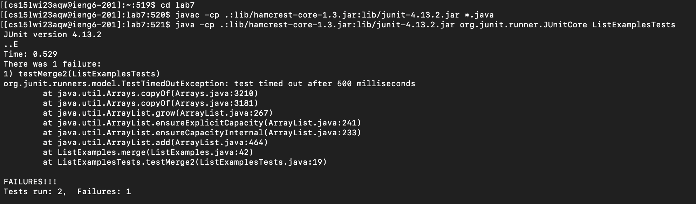

# Lab 4

## Step 4

 

Keys pressed: ```<control> r ssh <enter>```

Since I used the command ```ssh cs15lwi23aqw@ieng6.ucsd.edu``` before, I just typed control r to go to through the command history, then searched up ssh to access it, as it was the only command with ssh. Then I pressed enter to run the command. 

## Step 5
  

  
Keys pressed: ```git clone <command> v <enter>```
  
There's not really any point for me to search up this command in the history, because it's a relatively short command, so I just copied the ssh clone from github. Then, I just typed ```git clone``` and pressed ```<command> v``` to paste the ssh clone URL. 
  
## Step 6
  
 
  
Keys pressed: ```cd lab7 <enter>```, ```<control> r javac <enter>```, ```<control> r java <control> r <control> r <enter>```
  
I first changed directory with the cd command to get to the lab7 directory, then I searched up the javac command using ```<control> r```, because I did it before during the lab. This led me to the command ```javac -cp .:lib/hamcrest-core-1.3.jar:lib/junit-4.13.2.jar *.java```. After searching it up and compiling the testers, I then had to search up the run command for the testers. I searched up java using ```<control> r```, but I had to press ```<control> r``` two more times, because the first two times led me to the compiling command that we already used in this step. The last ```<control> r``` showed the right command to run the test, and since I already ran the test in lab, the whole command is filled out with the java file we are testing with, which in this case is ListExamplesTest. The whole command is java ```-cp .:lib/hamcrest-core-1.3.jar:lib/junit-4.13.2.jar org.junit.runner.JUnitCore ListExamplesTests```

# Step 7
 


Keys pressed: ```nano ListExamples.java <enter>```, ```<control> <shift> - 43 <enter>```, ```<right> <right> <right> <right> <right> <right> <right> <right> <right> <right> <right> <right> <delete> 2 <control> o <enter>```, ```<control> x```
  
I first used the nano command to edit the ListExamples.java file. From the lab, I knew that the mistake was in line 43, so I used ```<control> <shift> - 43``` to get to line 43. Then I used the right arrow 12 times to get to the right place where I can change index1 to index2. After deleting 1 and changing it to index2, I used ```<control> o <enter>``` and ```<control> x``` to save the changes and exit ListExamples.java.

# Step 8


Keys pressed: ```<up> <up> <up> <enter>```, ```<up> <up> <up> <enter>```

Pressing the up arrow one time will get me to the ```nano ListExamples.java``` command, and pressing up again will get me to ```java -cp .:lib/hamcrest-core-1.3.jar:lib/junit-4.13.2.jar org.junit.runner.JUnitCore ListExamplesTests```. Pressing the up arrow will get me to ```javac -cp .:lib/hamcrest-core-1.3.jar:lib/junit-4.13.2.jar *.java``` command, which is used to compile the test files in the lab7 directory. In order to run the test files, I need to press the up arrow three times then pressing enter, because the ```java -cp .:lib/hamcrest-core-1.3.jar:lib/junit-4.13.2.jar org.junit.runner.JUnitCore ListExamplesTests``` command is three down in history. After running those two commands, it showed that both tests ran and passed.

# Step 9

Keys pressed: ```git add ListExamples.java```, ```git commit -m "Updated"```, ```git push origin main```

The first part of this step is adding the ListExamples.java file to the staging area so that ```git commit -m "Updated"``` will work on the ListExamples.java file. If ```git add ListExamples.java``` command isn't ran, then ```git commit -m "Updated"``` would fail to commit the ListExamples.java file. After running ```git addListExamples.java```, I ran ```git commit -m "Updated"``` to commit to file. I then ran ```git push origin main``` to push the changes onto Github. 

  

  
  
